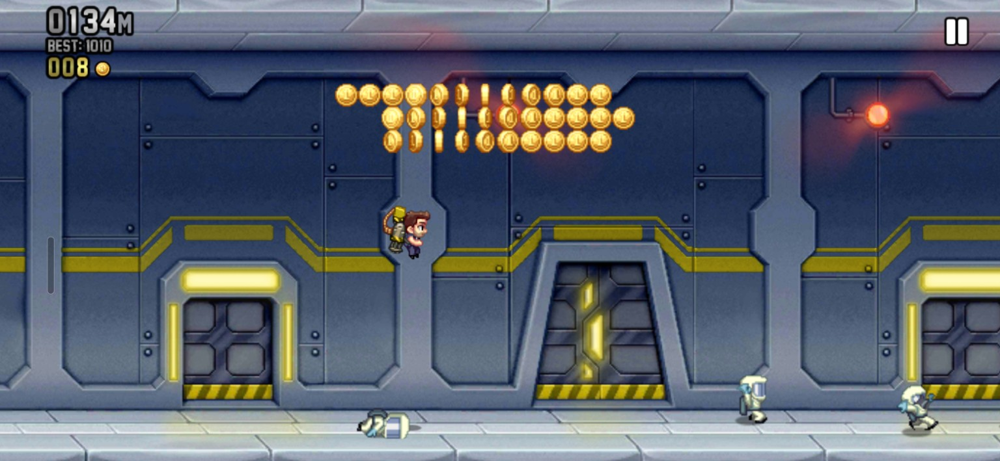
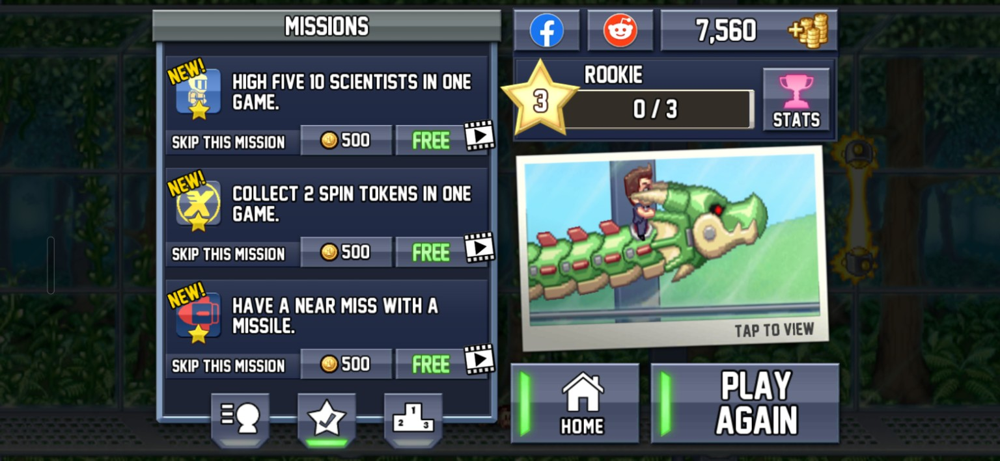
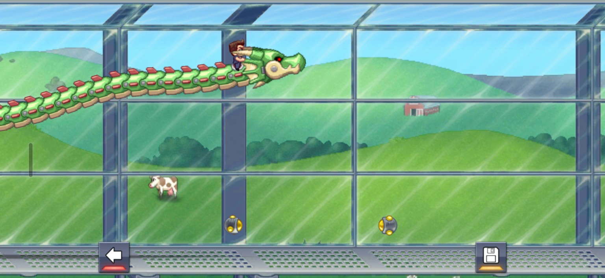
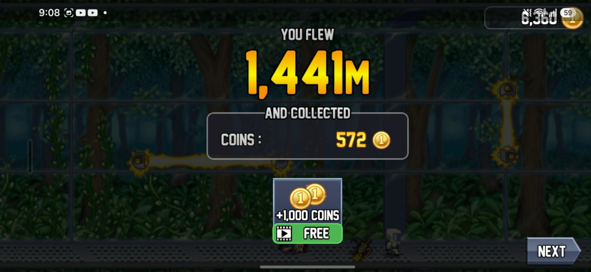

# CS464 Assignment 01 · Muhammad Abdullah · BSCS25061

## Game 1 · Jetpack Joyride

- **Store link:** [ADD GOOGLE PLAY LINK]
- **Genre:** Endless runner / arcade
- **I played:** Approximately 33 minutes, completed the tutorial, reached Rookie rank 3, and achieved a best distance of 1,441 m.

1. **[M1, M6]** · Jetpack movement during a run while collecting coins.
2. **[M3]** · A vehicle pickup changes the normal movement system and temporarily protects the player.
3. **[M4]** · Missions give the player specific objectives that influence how each run is played.
4. **[M2]** · The game records distance and saves the player's best distance as a high score.

| # | Mechanic | Dynamic | Aesthetic | Bartle type |
|---|---|---|---|---|
| M1 | Holding the screen fires Barry's machine-gun jetpack downward and makes him rise, while releasing the screen makes him fall. | Players repeatedly hold and release the screen to control their height and move around hazards. | **Challenge:** precise height control becomes increasingly important as more hazards appear. | **Achiever:** players act on the game world to survive and travel farther. |
| M2 | The player's distance increases continuously during a run and their best distance is saved as a high score. | Players repeatedly start new runs and try to travel farther than their previous best. | **Challenge:** beating a previous distance requires increasingly successful runs. | **Achiever:** the player is trying to beat a measurable goal set by the game. |
| M3 | Collecting a vehicle pickup replaces Barry's normal movement with a temporary vehicle that has different controls and protects him until it is destroyed. | Players adapt their movement strategy when using different vehicles and may take more risks while protected. | **Discovery:** each vehicle gives the player a different movement system to learn. | **Explorer:** players interact with the game world to discover how different vehicles behave. |
| M4 | The game gives missions such as reaching a certain distance, collecting vehicles, high-fiving scientists or narrowly avoiding missiles. | Players alter how they approach a run in order to complete the current mission instead of only focusing on distance. | **Challenge:** missions create additional goals that must be deliberately completed. | **Achiever:** completing objectives contributes to progression and rank advancement. |
| M5 | After death, the game can offer revival options that allow the player to continue the same run instead of immediately restarting. | Players may save revival resources for runs in which they are close to beating their high score. | **Challenge:** continuing a strong run gives the player another chance to reach a difficult target. | **Achiever:** reviving helps the player continue pursuing measurable progress. |
| M6 | Coins collected during runs act as currency that can be spent on boosts, revives and other equipment. | Players move toward coin trails and decide whether to save their currency or spend it to improve later runs. | **Challenge:** resource collection and spending can improve the player's chances of surviving longer. | **Achiever:** coins are used to improve performance and progression in the game. |
| M7 | Colliding with hazards such as zappers or missiles ends the run unless the player is protected by a vehicle or another defensive effect. | Players constantly adjust their height and timing to avoid hazards and remain alive for longer. | **Challenge:** survival depends on reacting correctly to increasingly difficult obstacles. | **Achiever:** avoiding failure lets the player continue increasing distance and score. |

**Aesthetic profile:**  
Jetpack Joyride mainly focuses on **Challenge**, **Sensation**, and **Submission**. Challenge comes from controlling Barry precisely, avoiding hazards, completing missions and trying to beat previous distances. Sensation comes from the responsive jetpack movement, explosions, vehicles, sound effects and visual feedback. Submission is also important because runs are short, easy to restart and suitable for repeated casual play.

**Player types**
- **Primary: Achiever (Acting × World)**, because the game constantly gives measurable goals such as increasing distance, beating high scores, completing missions and progressing through ranks (M2, M4, M7).
- **Secondary: Explorer (Interacting × World)**, because players discover how different vehicles, power-ups and systems behave and adapt to them during play (M3).
