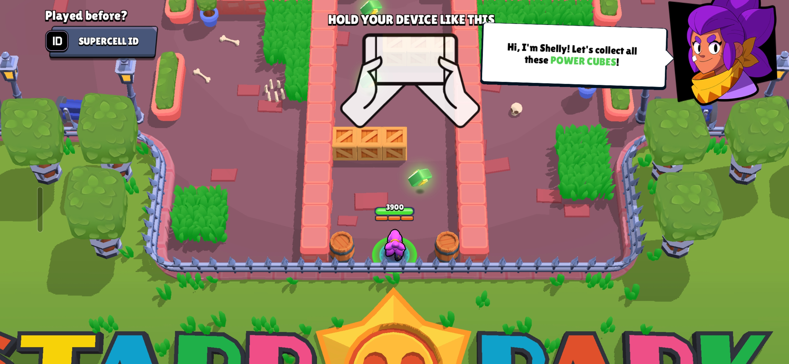
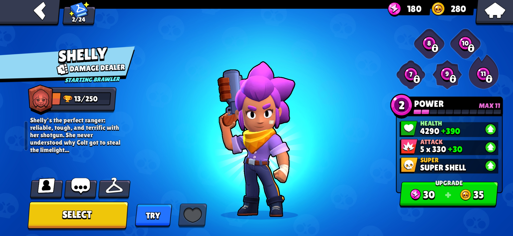
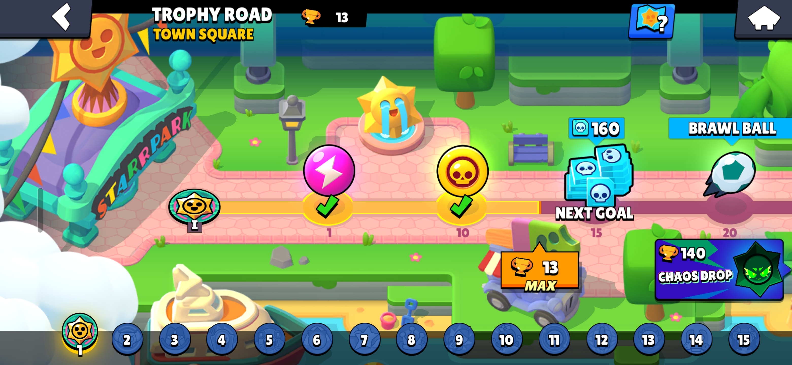
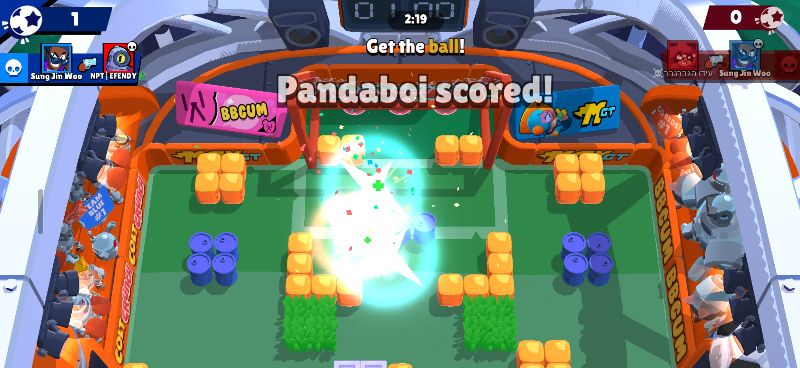
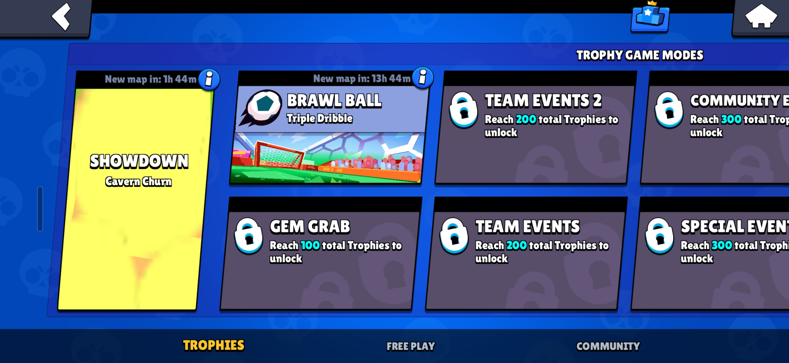
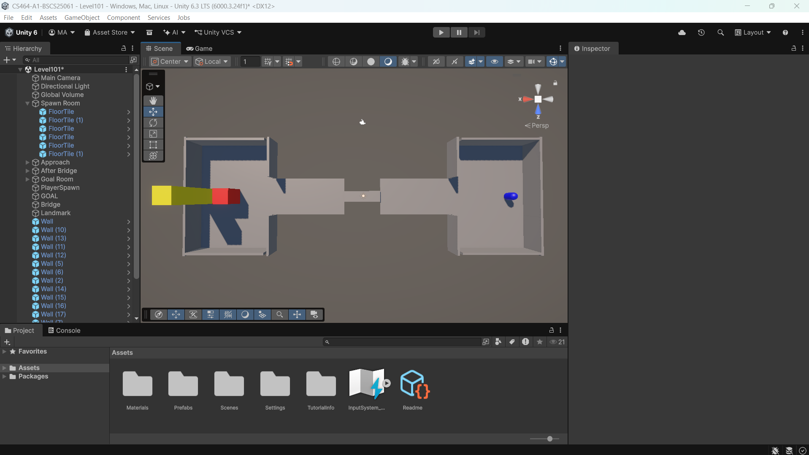
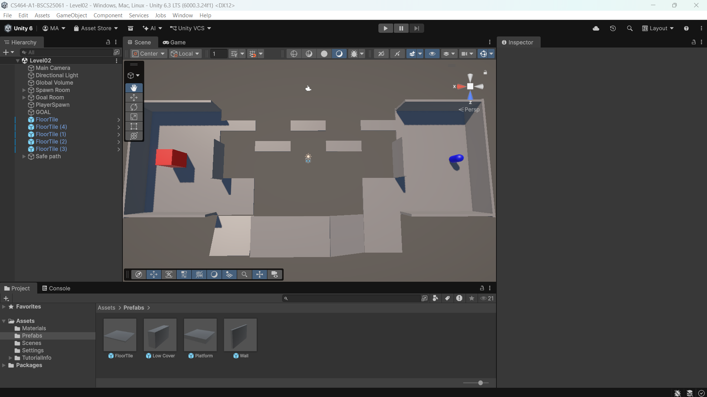
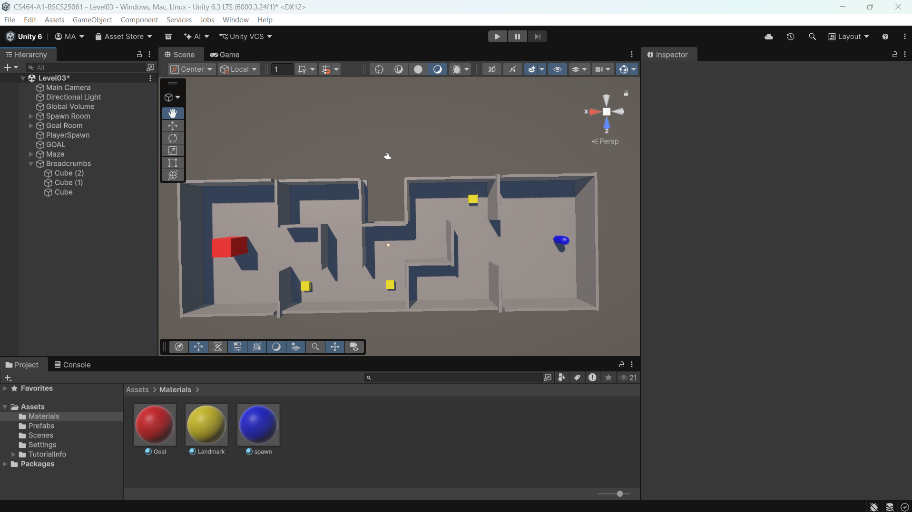
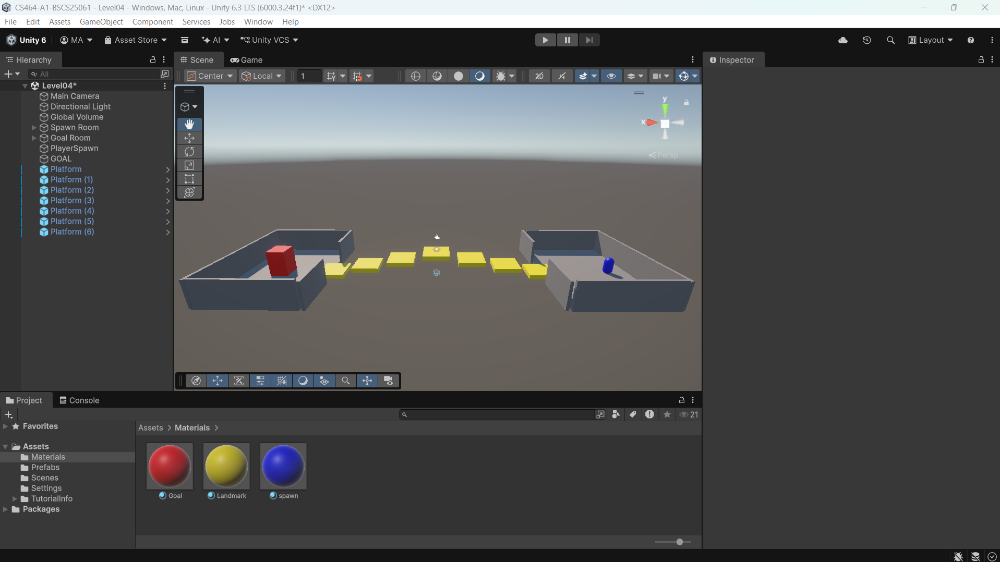
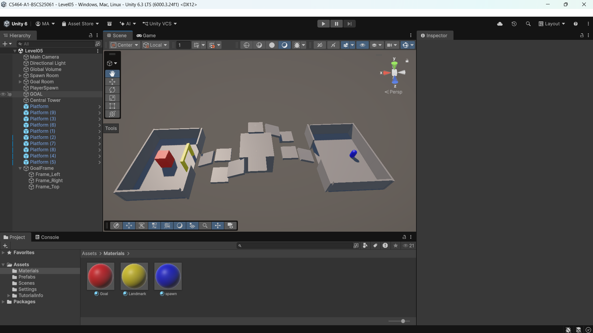

# CS464 Assignment 01 · Muhammad Abdullah · BSCS25061

## Game 1 · Jetpack Joyride

- **Store link:** [https://play.google.com/store/apps/details?id=com.halfbrick.jetpackjoyride&hl=en&pli=1]
- **Genre:** Endless runner / arcade
- **I played:** Approximately 33 minutes, completed the tutorial, reached Rookie rank 3, and achieved a best distance of 1,441 m.

1. **[M1, M6]** · Jetpack movement during a run while collecting coins.
2. **[M4]** · Missions give the player specific objectives that influence how each run is played.
3. **[M3]** · A vehicle pickup changes the normal movement system and temporarily protects the player.
4. **[M2]** · The game records distance and saves the player's best distance as a high score.

| # | Mechanic | Dynamic | Aesthetic | Bartle type |
|---|---|---|---|---|
| M1 | Holding the screen fires Barry's machine-gun jetpack downward and makes him rise, while releasing the screen makes him fall. | Players repeatedly hold and release the screen to control their height and move around hazards. | **Challenge:** precise height control becomes increasingly important as more hazards appear. | **Achiever:** players act on the game world to survive and travel farther. |
| M2 | The player's distance increases continuously during a run and their best distance is saved as a high score. | Players repeatedly start new runs and try to travel farther than their previous best. | **Challenge:** beating a previous distance requires increasingly successful runs. | **Achiever:** the player is trying to beat a measurable goal set by the game. |
| M3 | Collecting a vehicle pickup replaces Barry's normal movement with a temporary vehicle that has different controls and protects him until it is destroyed. | Players adapt their movement strategy when using different vehicles and may take more risks while protected. | **Discovery:** each vehicle gives the player a different movement system to learn. | **Explorer:** players interact with the game world to discover how different vehicles behave. |
| M4 | The game gives missions such as reaching a certain distance, collecting vehicles, high-fiving scientists or narrowly avoiding missiles. | Players alter how they approach a run in order to complete the current mission instead of only focusing on distance. | **Challenge:** missions create additional goals that must be deliberately completed. | **Achiever:** completing objectives contributes to progression and rank advancement. |
| M5 | After death, the game can offer revival options that allow the player to continue the same run instead of immediately restarting. | Players may save revival resources for runs in which they are close to beating their high score. | **Challenge:** continuing a strong run gives the player another chance to reach a difficult target. | **Achiever:** reviving helps the player continue pursuing measurable progress. |
| M6 | Coins collected during runs act as currency that can be spent on boosts, revives and other equipment. | Players move toward coin trails and decide whether to save their currency or spend it to improve later runs. | **Challenge:** resource collection and spending can improve the player's chances of surviving longer. | **Achiever:** coins are used to improve performance and progression in the game. |
| M7 | Colliding with hazards such as zappers or missiles ends the run unless the player is protected by a vehicle or another defensive effect. | Players constantly adjust their height and timing to avoid hazards and remain alive for longer. | **Challenge:** survival depends on reacting correctly to increasingly difficult obstacles. | **Achiever:** avoiding failure lets the player continue increasing distance and score. |

**Aesthetic profile:**  
Jetpack Joyride mainly focuses on **Challenge**, **Sensation**, and **Submission**. Challenge comes from controlling Barry precisely, avoiding hazards, completing missions and trying to beat previous distances. Sensation comes from the responsive jetpack movement, explosions, vehicles, sound effects and visual feedback. Submission is also important because runs are short, easy to restart and suitable for repeated casual play.

**Player types**
- **Primary: Achiever (Acting × World)**, because the game constantly gives measurable goals such as increasing distance, beating high scores, completing missions and progressing through ranks (M2, M4, M7).
- **Secondary: Explorer (Interacting × World)**, because players discover how different vehicles, power-ups and systems behave and adapt to them during play (M3).

## Game 2 · Brawl Stars

- **Store link:** [https://play.google.com/store/apps/details?id=com.supercell.brawlstars&hl=en]
- **Genre:** Multiplayer action / hero shooter
- **I played:** Completed the introductory tutorial, played Solo Showdown and Brawl Ball, upgraded and unlocked Brawlers, and progressed through the Trophy Road.

1. **[M1, M2]** · The tutorial introduces movement and attacking while the player learns how to control a Brawler.
2. **[M4]** · Power Points and Coins can be spent to upgrade Brawlers and improve their combat statistics.
3. **[M5]** · Trophy Road provides progression milestones and rewards as the player earns trophies.
4. **[M3]** · Brawl Ball changes the objective from simply defeating opponents to carrying the ball and scoring goals.
5. **[M6]** · Additional game modes are unlocked as the player's total trophy count increases.

| # | Mechanic | Dynamic | Aesthetic | Bartle type |
|---|---|---|---|---|
| M1 | The player moves their Brawler around the arena using a movement control. | Players constantly reposition themselves to approach enemies, avoid attacks, use cover and move toward objectives. | **Challenge:** good positioning is important for both survival and attacking effectively. | **Killer:** movement is mainly used to gain an advantage over opposing players during combat. |
| M2 | The player can aim and fire the Brawler's main attack, while dealing damage also contributes toward combat abilities such as the Super. | Players decide when to attack, when to retreat and how to position themselves so their attacks connect with opponents. | **Challenge:** combat requires aiming, timing and positioning against moving opponents. | **Killer:** the mechanic directly allows the player to attack and defeat other players. |
| M3 | Different game modes have different victory conditions. For example, Solo Showdown requires the player to survive against other Brawlers, while Brawl Ball requires a team to score goals with the ball. | Players must change their strategy depending on the selected mode rather than approaching every match in the same way. | **Challenge:** each mode creates a different objective and requires different tactics. | **Killer / Achiever:** players fight opponents while also trying to complete the mode's measurable victory objective. |
| M4 | Brawlers can be upgraded by spending resources such as Power Points and Coins, increasing attributes such as health and attack strength. | Players collect resources and choose which Brawlers they want to invest in and improve. | **Challenge:** stronger Brawlers allow players to compete more effectively as they progress. | **Achiever:** upgrading characters provides visible and measurable long-term progression. |
| M5 | Winning matches awards trophies, which contribute toward Trophy Road progression and unlock rewards at specific milestones. | Players repeatedly play matches to increase their trophy total and reach the next reward milestone. | **Challenge:** reaching higher trophy milestones requires continued successful play. | **Achiever:** Trophy Road gives players a clear sequence of progression goals and rewards. |
| M6 | Some game modes are unavailable at the beginning and become accessible after reaching required total trophy counts. | Players are encouraged to continue playing existing modes so they can gain enough trophies to unlock additional ways to play. | **Discovery:** progressing through the game gradually reveals new modes and objectives. | **Explorer / Achiever:** players discover new gameplay possibilities while also working toward trophy requirements. |
| M7 | Different Brawlers have different attacks, statistics, roles and special abilities. New Brawlers can also be unlocked through progression systems such as Credits. | Players experiment with different Brawlers and adapt their playstyle according to each character's strengths and abilities. | **Discovery:** unlocking and learning new Brawlers gives the player new mechanics and combat styles to explore. | **Explorer:** players learn how different characters and abilities behave and determine which suit their preferred style. |

**Aesthetic profile:**  
Brawl Stars mainly focuses on **Challenge, Fellowship, Discovery, and Sensation**. Challenge comes from aiming attacks, surviving enemy pressure and completing the different objectives of each mode. Fellowship is especially important in team modes such as Brawl Ball, where players cooperate to control the arena and score goals. Discovery comes from unlocking new Brawlers, learning their abilities and gaining access to additional game modes through progression. Sensation comes from the game's fast combat, colourful visual effects, character animations, attacks and strong audiovisual feedback during matches.

**Player types**

- **Primary: Killer (Acting × Players)**, because much of the core gameplay revolves around directly fighting opposing players, dealing damage, defeating them and gaining positional advantages during matches (M1, M2, M3).
- **Secondary: Achiever (Acting × World)**, because trophies, Trophy Road milestones, Brawler upgrades and game-mode unlock requirements give the player many measurable progression goals to pursue (M4, M5, M6).
- **Additional: Explorer (Interacting × World)**, because players can unlock and experiment with different Brawlers, abilities and game modes as they progress (M6, M7).

## Level blockouts

| Level | Screenshot | Its idea | Wayfinding tool |
|---|---|---|---|
| Level01 |  | An introductory route connects two enclosed spaces through a narrow bridge, requiring the player to carefully cross the middle section before reaching the goal. | **Landmark:** a tall, brightly coloured pillar beside the goal gives the player a visible destination to move toward. |
| Level02 |  | A split-route level gives the player a choice between a short risky path with gaps and a longer, wider elevated path with ramps. | **Leading lines:** the shapes and edges of the two routes visually guide the player from the spawn room toward the goal room. |
| Level03 |  | A maze forces the player to navigate several turns and corridors before reaching the goal. | **Breadcrumbs:** small yellow markers are placed along the intended route to help guide the player through the maze. |
| Level04 |  | A sequence of separated platforms rises toward a central peak and then descends toward the goal, requiring repeated jumps. In a scripted version, the highest platform could move horizontally or vertically to increase the challenge. | **Contrast:** the yellow platforms stand out clearly from the surrounding grey geometry and show the intended traversal route. |
| Level05 |  | An elevated route winds around a large central tower before the player reaches the final goal area. | **Framing:** a bright yellow arch frames the entrance to the goal room and draws attention toward the destination. |